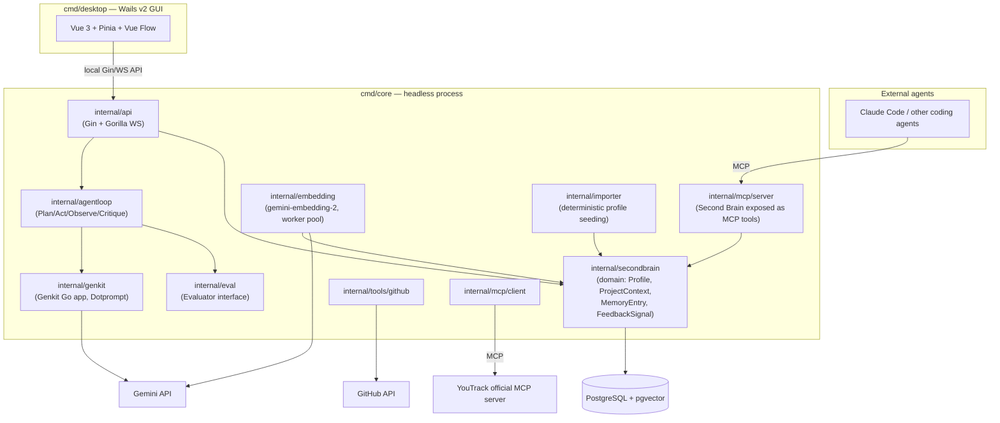
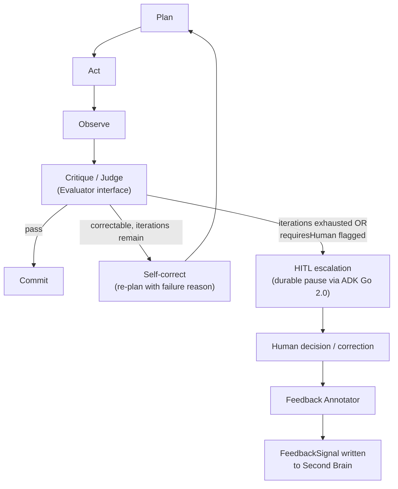

# SYSTEM.md — architecture overview

**This describes the target architecture from the approved design doc. It is not yet built.** See [`PLAN.md`](PLAN.md) for what actually exists at any point in time; if this file and `PLAN.md`'s status ever disagree, `PLAN.md` is correct and this file needs updating.

Full rationale: [sub-project 1 design doc](docs/superpowers/specs/2026-07-06-foundation-second-brain-design.md).

## Process architecture

Two entrypoints, one shared internal codebase. `cmd/core` is a headless process that keeps the Second Brain and its MCP server reachable independent of whether the GUI is open — this was chosen specifically because a monolith-desktop design (everything inside the Wails process) would mean external agents lose access the moment you close the window.

## Agent Loop primitive

Every agent built in later sub-projects (chat, voice, orchestrator, tool-agents) runs through this same loop shape. It is deliberately bounded — unbounded self-correction is a resilience hazard, not a feature (see [`docs/adr/0007-bounded-agent-loop-honest-rlhf.md`](docs/adr/0007-bounded-agent-loop-honest-rlhf.md)).

Provider-level retry (rate limits, transport errors) is handled inside Genkit's middleware, one layer below this diagram — the Agent Loop never sees a provider failure, only a semantic Critique verdict. Keeping these two resilience layers orthogonal is deliberate; see [`docs/adr/0007-bounded-agent-loop-honest-rlhf.md`](docs/adr/0007-bounded-agent-loop-honest-rlhf.md).

## Related docs

- [`MEMORY.md`](MEMORY.md) — the Second Brain's data model and import pipeline in detail
- [`docs/adr/`](docs/adr/) — one ADR per major architectural decision reflected in the diagrams above
