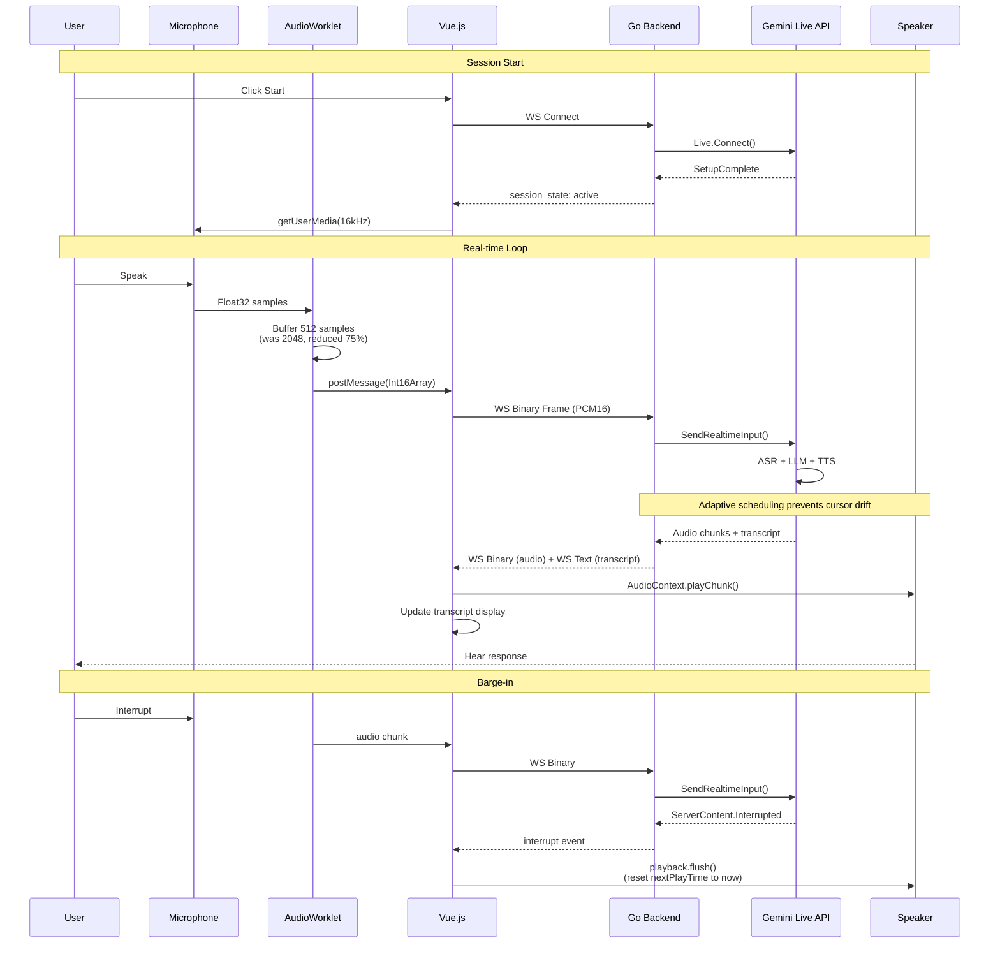

# Agentic Desk — Architecture Guide

> **Audience:** Developers, architects, and AI agents implementing features.
> **Purpose:** Describe the system architecture, component relationships, and data flow.

---

## Table of Contents

1. [System Overview](#system-overview)
2. [Architecture Diagram](#architecture-diagram)
3. [Component Architecture](#component-architecture)
4. [Data Flow](#data-flow)
5. [Directory Layout](#directory-layout)
6. [Voice Pipeline](#voice-pipeline)
7. [Key Design Decisions](#key-design-decisions)

---

## System Overview

Agentic Desk is a **desktop-native AI assistant** with a Go backend, Vue.js frontend, and WebSocket-based real-time voice. Backend services (Second Brain, knowledge graph, voice relay) run as a local child process auto-launched by the desktop shell.

---

## Architecture Diagram

```mermaid
graph TB
    subgraph "Desktop App (Wails)"
        direction TB
        FW[Vue.js Frontend<br/>WKWebView]
        DW[Desktop Wrapper<br/>cmd/desktop]
        CL[Core Launcher<br/>corelauncher.go]
    end

    subgraph "Core Backend (Go)"
        direction TB
        API[HTTP+WS API<br/>internal/api]
        SB[Second Brain<br/>internal/secondbrain]
        AG[Agent Loop<br/>internal/agentloop]
        VL[Voice Live<br/>internal/voicelive]
        EV[Evaluator<br/>internal/eval]
        IM[Importer<br/>internal/importer]
        ED[Embedding<br/>internal/embedding]
        GK[Genkit Flows<br/>internal/genkit]
        CFG[Config<br/>internal/config]
    end

    subgraph "External"
        GL[Gemini Live API]
        GM[Gemini Models<br/>(text + multimodal)]
        PG[PostgreSQL<br/>agentic_desk]
    end

    FW <-->|HTTP/WS| API
    DW -->|auto-launch| CL
    CL -->|exec| API
    
    API --> VL
    VL -->|WebSocket| GL
    
    API --> SB
    API --> AG
    API --> GK
    
    SB --> PG
    SB --> ED
    ED --> GM
    
    AG --> GM
    AG --> EV
    AG --> SB
    
    GK --> GM
    
    IM --> ED
    IM --> SB

    style FW fill:#42b883,color:#fff
    style DW fill:#00add8,color:#fff
    style CL fill:#f0db4f,color:#333
    style API fill:#00add8,color:#fff
    style VL fill:#7c3aed,color:#fff
    style GL fill:#4285f4,color:#fff
    style GM fill:#4285f4,color:#fff
    style PG fill:#336791,color:#fff
```

---

## Voice Pipeline



---

## Component Architecture

```
+-------------------+     +---------------------+     +------------------+
|   Desktop Shell   | --> |   Core Backend      | --> |   Gemini API     |
|   (Wails v2)      |     |   (Go binary)       |     |   (Google Cloud) |
|                   |     |                     |     |                  |
| - Vue.js Frontend |     | - HTTP+WS API       |     | - Live (voice)   |
| - WKWebView       |     | - Second Brain      |     | - Genkit (text)  |
| - Core Launcher   |     | - Voice Live relay  |     | - Embeddings     |
+-------------------+     | - Genkit Flows      |     +------------------+
                           | - Agent Loop        |
                           +---------------------+
                                    |
                                    v
                           +------------------+
                           |   PostgreSQL     |
                           |   (local db)     |
                           +------------------+
```

## Directory Layout

```
agentic-desk/
├── cmd/
│   ├── desktop/           ← Desktop app (Wails)
│   │   ├── main.go        ← App entry, Wails config
│   │   ├── app.go         ← App lifecycle (startup/shutdown)
│   │   ├── corelauncher.go← Auto-launches core backend
│   │   ├── secrets.go     ← Persisted env for packaged app
│   │   ├── frontend/      ← Vue.js SPA
│   │   │   ├── src/
│   │   │   │   ├── components/  ← All views
│   │   │   │   ├── lib/         ← SDK + utilities
│   │   │   │   └── stores/      ← Pinia stores
│   │   │   └── public/
│   │   │       └── pcm-capture-worklet.js  ← AudioWorklet
│   │   └── build/bin/agentic-desk.app/    ← Packaged .app
│   └── core/              ← Backend server binary
├── internal/
│   ├── api/               ← HTTP+WS routes
│   ├── secondbrain/       ← Domain types + Store interface
│   │   └── postgres/      ← Postgres implementation
│   ├── agentloop/         ← Plan/Act/Observe/Critique loop
│   ├── voicelive/         ← Gemini Live relay
│   ├── genkit/            ← Genkit flow registration
│   ├── embedding/         ← Embedder wrapper
│   ├── eval/              ← Evaluator interface
│   ├── importer/          ← Markdown parser
│   ├── config/            ← Environment config loading
│   └── tools/             ← Tool implementations
├── docs/                  ← Documentation
├── skills/                ← Shipped agent skills
├── prompts/               ← Dotprompt files
├── migrations/            ← SQL migrations
└── brand/                 ← Brand assets
```

## Key Design Decisions

| Area | Decision | Rationale |
|------|----------|-----------|
| Desktop shell | Wails v2 (Go) | Same language as backend, native perf |
| Voice protocol | Binary PCM16 + JSON WS | Reference-proven wire format |
| Mic capture | AudioWorklet | Raw PCM16 streaming, not compressed blobs |
| Audio chunk | 512 samples (32ms) | Reduced from 2048 for lower latency |
| Playback | Gapless with adaptive cursor | Prevents scheduling drift accumulation |
| Auth for packaged app | Persisted `.env` file | Finder-launched apps have no shell env |
| Database | Local PostgreSQL | Trust-auth, no password needed |
| AI Provider | Gemini (Google) | Existing SDK integration, Live support |
| Level meter | Reuses capture AudioContext | Avoids third AudioContext thread |

---

## Performance Characteristics

| Metric | Target | Measured |
|--------|--------|----------|
| Voice input latency | <50ms | 32ms (chunk @ 512 samples at 16kHz) |
| Playback drift | <50ms | <30ms (adaptive cursor) |
| Noise calibration | <1s | 0.5s (10 frames) |
| Session startup | <2s | ~1.5s (WS + SetupComplete) |
| Memory (idle) | <100MB | ~60MB |
| Bundle size | <20MB | ~15MB |

## Security Boundaries

1. **API runs on loopback only** (`127.0.0.1:8080`) — not exposed to LAN
2. **API key stored at `~/Library/Application Support/agentic-desk/.env`** — `chmod 600`
3. **No secrets in source code** — all keys from env or persisted file
4. **Input sanitization** via DOMPurify in markdown rendering
5. **WebSocket origin validation** on upgrade
